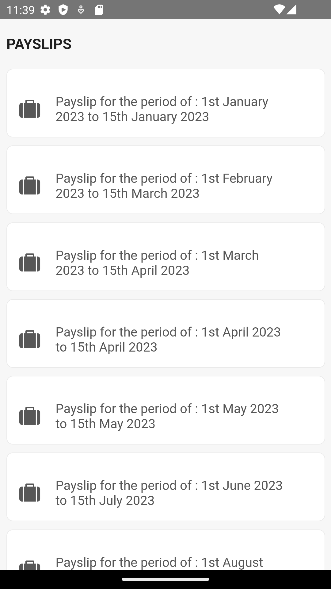
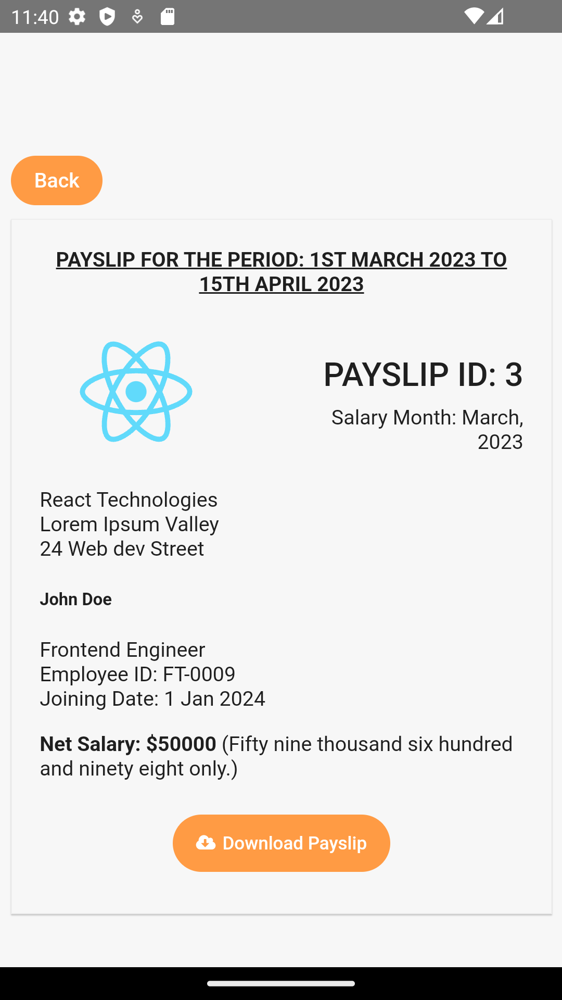

# Payslips Cross-Platform Application

This application is built with React and Capacitor to manage and view payslips.

##  Installation

Follow the steps below to set up and run the application:
 ### ```    npm install  ```

##  Build the Application:
 ###  ```npm run build ```

## Sync Capacitor with Platform:
 ### For Android
 ###  ```npx cap sync android```
   
 ### For IOS
 ###  ```npx cap sync ios```

## View The App on the Browser
 ###  ```npm start```

## View The App on the Android emulator
 ###  ```npx cap open android```

## View The App on Xcode
###   ```npx cap open ios```





